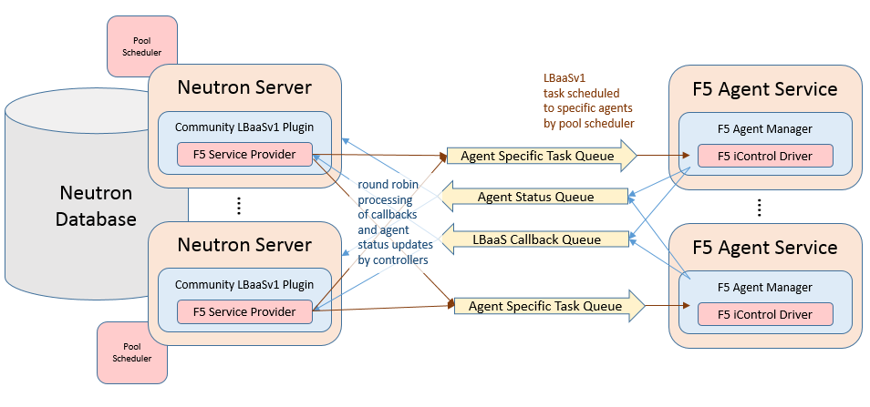

Architecture
------------

.. include:: includes/concept_lbaasv1-architecture-overview.rst
.. include:: includes/concept_f5-lbaasv1-plugin-architecture-overview.rst

    Figure 2. F5® LBaaSv1 Plugin Agent Architecture

.. include:: includes/topic_driver-agent-placement.rst
.. include:: includes/topic_neutron-agent-binding.rst
.. include:: includes/topic_bigip-environments.rst
.. include:: includes/topic_tip-agent-status.rst
    :start-line: 3
