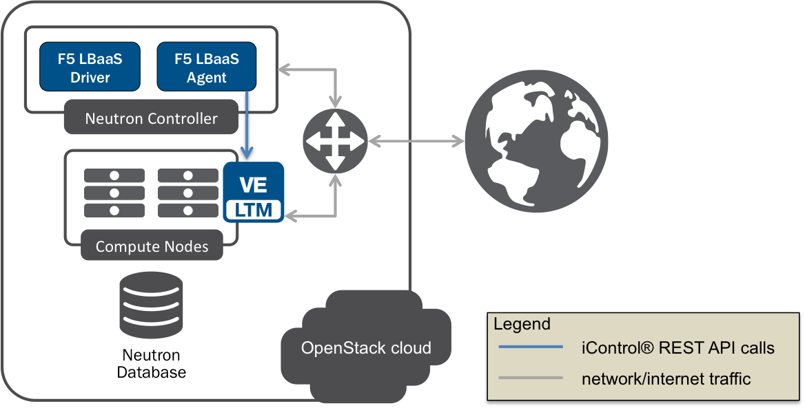
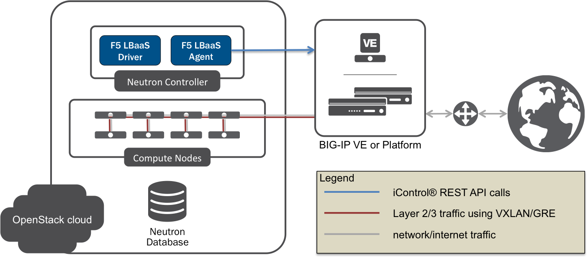
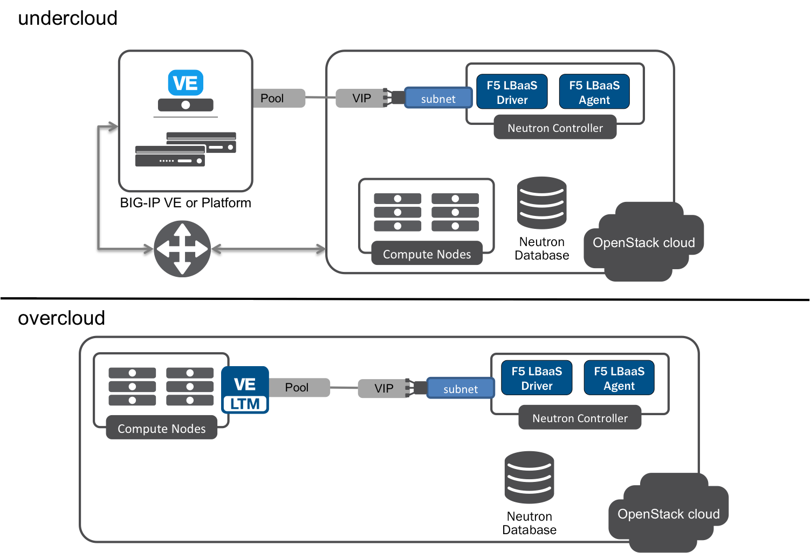
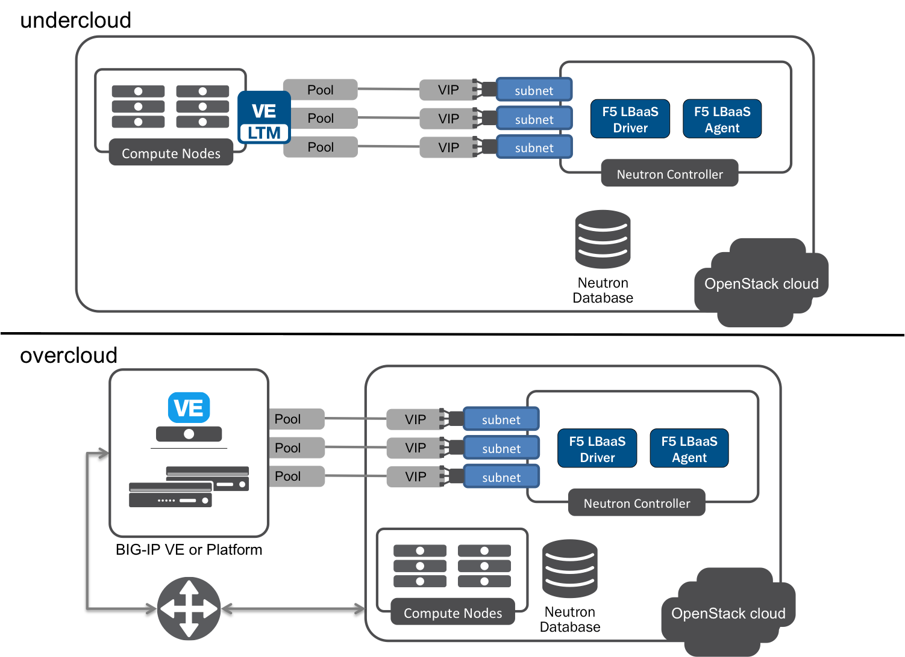
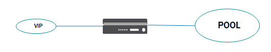
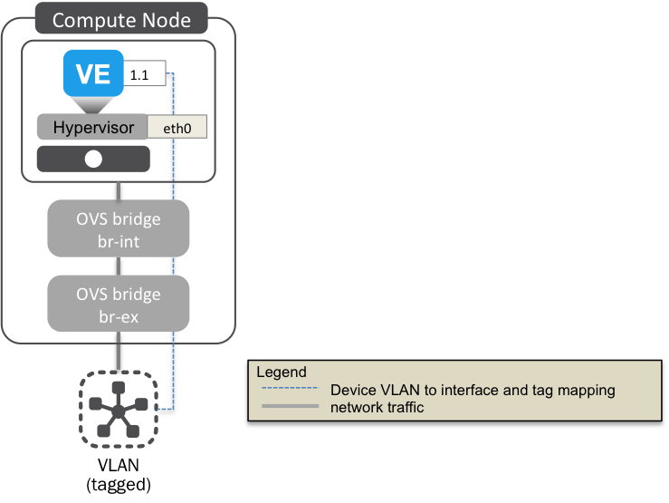

.. _supported-network-topologies:

Supported Network Topologies
----------------------------

.. include:: includes/concept_network-topologies.rst
    :start-line: 3

.. _global-routed-mode:

Global routed mode
``````````````````



    Figure. Global Routed Mode

.. include:: includes/topic_global-routed-mode.rst
    :start-line: 3

.. _l2-adjacent-mode:

L2 Adjacent Mode
````````````````



    Figure. L2 Adjacent Mode

.. include:: includes/topic_l2-adjacent-mode.rst
    :start-line: 3

.. _one-arm-mode:

One-Arm Mode
````````````



    Figure. One-arm Mode

.. include:: includes/topic_one-arm-mode.rst
    :start-line: 3

.. _multi-arm-mode:

Multiple-Arm mode
`````````````````



    Figure. Multiple-arm Mode

.. include:: includes/topic_multiple-arm-mode.rst
    :start-line: 3

.. _gateway-routed-mode:

Gateway Routed Mode
```````````````````



    Figure. Gateway Routed Mode

.. include:: includes/topic_gateway-routed-mode.rst
    :start-line: 3

.. _vlans:

VLANs
`````



    Device VLAN to interface and tag mapping

.. include:: includes/topic_vlans-mode.rst
    :start-line: 3


.. _tunnels:

Tunnels
```````

.. include:: includes/topic_tunnels-mode.rst
    :start-line: 3
