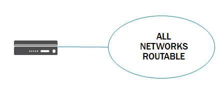
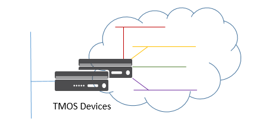
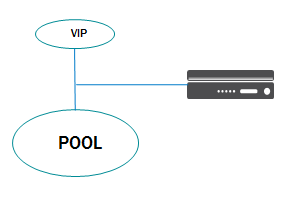
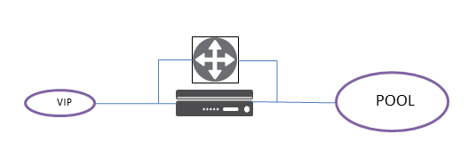

Supported Network Topologies
----------------------------

The F5® iControl® agent driver supports the following network topologies with either BIG-IP® hardware or virtual editions.

Global routed mode
``````````````````



    Figure 7. Global Routed Mode

.. include:: includes/topic_global-routed-mode.rst
    :start-line: 5

L2 Adjacent Mode
````````````````



    Figure 8. L2 Adjacent Mode Topology

.. include:: includes/topic_l2-adjacent-mode.rst
    :start-line: 5

One-Arm Mode
````````````



    Figure 9. One-arm Mode

.. include:: includes/topic_one-arm-mode.rst
    :start-line: 5

Multiple-Arm mode
`````````````````



    Figure 10. Multiple-arm Mode

.. include:: includes/topic_multiple-arm-mode.rst
    :start-line: 5

Gateway Routed Mode
```````````````````

.. figure:: media/routed_mode.png
    :alt: Gateway Routed Mode

    Figure 11. Gateway Routed Mode

.. include:: includes/topic_gateway-routed-mode.rst
    :start-line: 5

VLANs
`````

.. figure:: media/VE_Multitenant_VLAN_bypass.png
    :alt: VE Multi-tenant VLAN Bypass

    Figure 12. VE Multi-tenant VLAN Bypass

.. include:: includes/topic_vlans-mode.rst
    :start-line: 5

Tunnels
```````

.. include:: includes/topic_tunnels-mode.rst
    :start-line: 5