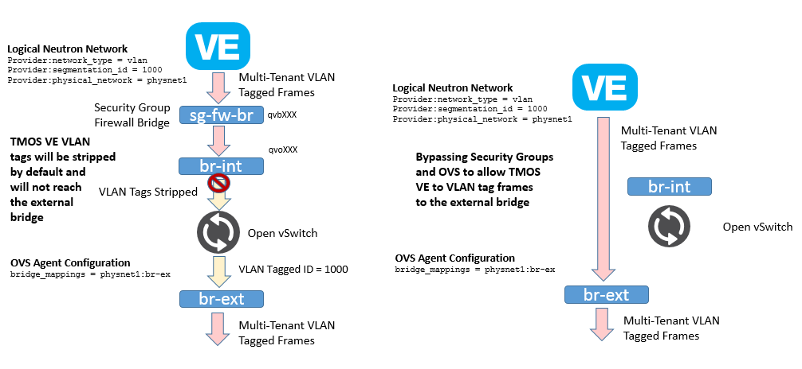

.. _supported-network-topologies:

Supported Network Topologies
----------------------------

The F5® iControl® agent driver supports the following network topologies with either BIG-IP® hardware or virtual editions.

.. _global-routed-mode:

Global routed mode
``````````````````


    Figure 7. Global Routed Mode

.. include:: includes/topic_global-routed-mode.rst
    :start-line: 5

.. _l2-adjacent-mode:

L2 Adjacent Mode
````````````````


    Figure 8. L2 Adjacent Mode Topology

.. include:: includes/topic_l2-adjacent-mode.rst
    :start-line: 5

.. _one-arm-mode:

One-Arm Mode
````````````

.. figure:: media/one_arm.png
    :alt: One-arm Mode

    Figure 9. One-arm Mode

.. include:: includes/topic_one-arm-mode.rst
    :start-line: 5

.. _multi-arm-mode:

Multiple-Arm mode
`````````````````


    Figure 10. Multiple-arm Mode

.. include:: includes/topic_multiple-arm-mode.rst
    :start-line: 5

.. _gateway-routed-mode:

Gateway Routed Mode
```````````````````

.. figure:: media/routed_mode.png
    :alt: Gateway Routed Mode

    Figure 11. Gateway Routed Mode

.. include:: includes/topic_gateway-routed-mode.rst
    :start-line: 5

.. _vlans:

VLANs
`````



    Figure 12. VE Multi-tenant VLAN Bypass

.. include:: includes/topic_vlans-mode.rst
    :start-line: 5

.. _tunnels:

Tunnels
```````

.. include:: includes/topic_tunnels-mode.rst
    :start-line: 5
